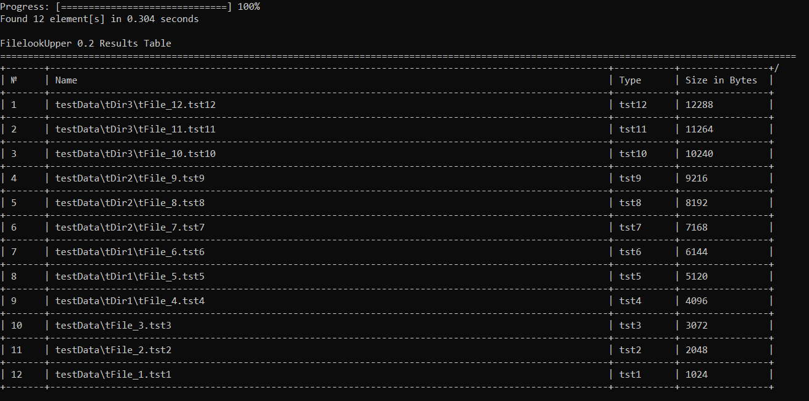

# File LookUpper

This is a simple project i've done to familiarize myself with python and its standard library. It exists solely for educational purposes.
So feel free to try it out and suggest ways to improve.

What it basically does is looks up directory sub structure of a given folder and outputs information about directory stucture in a table form according to provided options like filters and sort rules.


_Preview example_
```
$ python -m lookupper -r testData -c 0
```
## Getting Started
It is supposed to run as a script "lookupper" from command line by providing it arguments like root path and processing options.

## Prerequisites
All you need to run it is standard python3 (3.6+)

## Installing
For this step you'll need pip and wheel modules.  
To install it to your local environment via pip from source

```
$ pip install -e "%pathToProject%"
```

## Usage
```
$ python -m lookupper [args]
```
Use '-h' option to get help
## Running the tests
Tests are conducted using python unitests framework for processor.py module
Simply run tests_processor.py in the tests folder
```
$ python -m unittest %pathToProject%/tests/test_processor.py 
```
Tests build a temporary tree structure inside tests folder to check for expected output

## Deployment
Deploy via pip using setup.py script in project root directory

## Version history
See the [ChangeLog](changeLog.md)
  
## License
This project is licensed under the Apache License - see the [LICENSE.md](LICENSE.md) file for details
